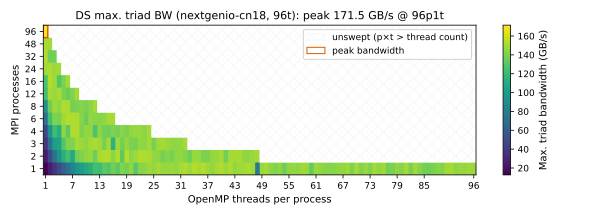
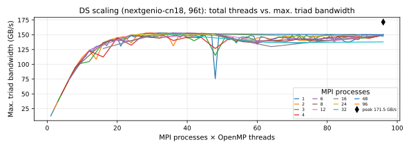
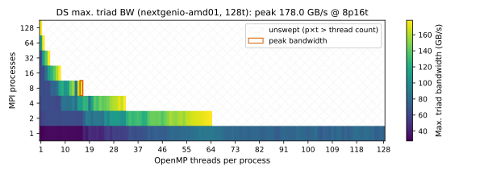
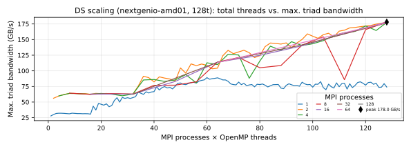
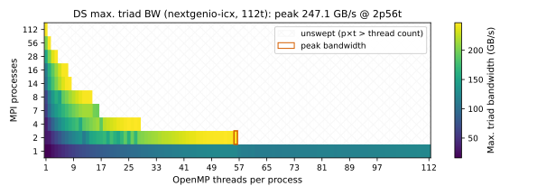
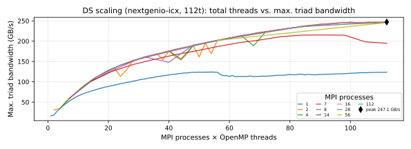
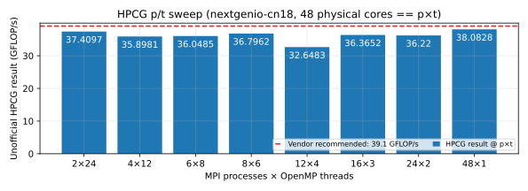
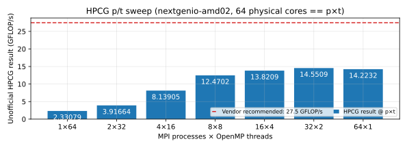
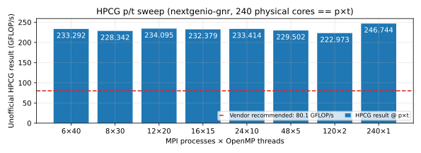
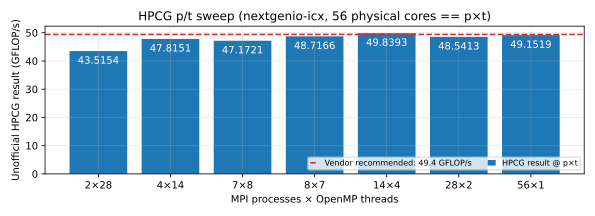

# NEXTGenIO Benchmark results (September 2026)

## Summary

All benchmarks were executed on a single compute node. Overview:

| Benchmark               | normal      | amd           | gnr           | icx           |
|-------------------------|-------------|---------------|---------------|---------------|
| DistributedStream sweep | `Ii`        | `Ii`*         | x             | `Ii`          |
| HPCG Intel recommended  | `Ii`        | -             | `Ii`†         | `Ii`          |
| HPCG AMD recommended    | -           | `AO`          | -             | -             |
| HPCG Intel sweep        | `Ii`†       | -             | `Ii`†         | `Ii`†         |
| HPCG AMD sweep          | -           | `AO`          | -             | -             |

* Benchmarks compiled with: `-`: Not applicable, `I`: Intel MPI Library 2021.15,
`i`: Intel oneAPI Compiler 2023.0.0, `A`: AMD AOCC 5.2.0, `O`: Open MPI 5.0.10
* \*: Compiled with the Intel oneAPI compiler, rather than AOCC. May not have
optimal performance on an AMD processor.
* x: Due to stability issues, this benchmark was omitted from the results -
crashes were not fully investigated to remain within time constraints.
* †: Had the problem size capped to prevent global index overflows. Some runs
filled less than 25% of the system's total memory capacity.

If you run the scripts in unscheduled mode (i.e. outwith SLURM) then please
remember to either run the script in the background using `nohup` (not
recommended), or better, run it in the by detaching from a `screen` (gnr) or
`tmux` (all other nodes) session to prevent your run from exiting when you end
your SSH session.

Please complete the setup process as described in [README](./README.md)
before running the benchmarks.

The following definitions are used throughout this document:

|      |                                        |
|------|----------------------------------------|
| p    | MPI process                            |
| t    | thread                                 |
| BW   | bandwidth                              |
| DS   | DistributedStream                      |
| HPCG | High Performance Conjugate Gradient    |
| OMB  | Ohio State University Micro-Benchmarks |

## DistributedStream

### nextgenio-cn18 (normal) DS

Benchmark invocation:

```bash
cd $HOME/benchmarks
sbatch ./dstream_single_node_sweep.sh
```





Peak bandwidth occurred at the 96p1t allocation - unusual if we expect
that SMT would cause some contention. I cannot rule out caching effects for
this result, as the array size is scaled by `2 * max(p) + 1024 * max(p)`
by default to ensure the problem size was not excessively large. This is
smaller than the typical 4x requirement in the 1p case, however it should still
be greater than 2 * L3 cache size in practice.

### nextgenio-amd01 (amd) DS

Benchmark invocation:

```bash
cd $HOME/benchmarks
LL_CACHE_SIZE=1677216 ./dstream_single_node_sweep.sh
```





In this test, amd01 is characterised by poor single process bandwidth
scaling.

### nextgenio-gnr (gnr) DS

Unfortunately, due to stability issues I was unable to resolve, this test would
crash when p > 1 and was also unstable at p = 1. There is no visualisation
for the gnr benchmark, but the XML output from a run (which crashed at t = 445)
with fixed p = 1 can be found under `/data`. Use
`dstream_sweep_results_to_csv.py` to convert to CSV.

Benchmark invocation:

```bash
cd $HOME/benchmarks
RUNNING_ON_GNR=1 LL_CACHE_SIZE=1056964608 ./dstream_single_node_sweep.sh
```

### nextgenio-icx (icx) DS

Benchmark invocation:

```bash
cd $HOME/benchmarks
LL_CACHE_SIZE=44040192 ./dstream_single_node_sweep.sh
```





In this test, icx has similar p = 1 scaling behaviour to amd01.

## High Performance Conjugate Gradient

### nextgenio-cn18 (normal) HPCG

To run the vendor-recommended settings:

```bash
cd $HOME/benchmarks
sbatch ./intel_hpcg_single_node_recommended_config.sh
```

To run the sweep:

```bash
cd $HOME/benchmarks
CLAMP_PROB_SIZE=1 sbatch ./hpcg_single_node_sweep.sh intel
```



In this test, nextgenio-cn18's HPCG result remained insensitive to varying p/t decomposition.

### nextgenio-amd01 (amd) HPCG

To run the vendor-recommended settings:

```bash
cd $HOME/benchmarks
./amd_hpcg_single_node_recommended_config.sh
```

To run the sweep:

```bash
cd $HOME/benchmarks
CLAMP_PROB_SIZE=1 ./hpcg_single_node_sweep.sh amd
```



In this test there is a noticeable HPCG result gap between AMD's recommendation
of 2p2t per CCX for the EPYC 7502 and the sweep script's generic affinity
behaviour.

### nextgenio-gnr (gnr) HPCG

To run the vendor-recommended settings:

```bash
cd $HOME/benchmarks
RUNNING_ON_GNR=1 NX=376 NY=376 NZ=376 NPROC=6 PPN=3 OMP_NUM_THREADS=40 MKL_NUM_THREADS=40 ./intel_hpcg_single_node_recommended_config.sh
```

To run the sweep:

```bash
cd $HOME/benchmarks
RUNNING_ON_GNR=1 CLAMP_PROB_SIZE=1 CLAMPSZ=376 ./hpcg_single_node_sweep.sh intel
```



Here the sweep's generic affinity outperforms me attempting to follow the
vendor recommendation of 1 rank per "natural division" (I decided to use 6, 1
per sub-NUMA cluster - evidently more work is required to identify the most
natural division).

### nextgenio-icx (icx) HPCG

To run the vendor-recommended settings:

```bash
cd $HOME/benchmarks
NX=360 NY=360 NZ=368 OMP_NUM_THREADS=28 MKL_NUM_THREADS=28 ./intel_hpcg_single_node_recommended_config.sh
```

To run the sweep:

```bash
cd $HOME/benchmarks
CLAMP_PROB_SIZE=1 ./hpcg_single_node_sweep.sh intel
```



In this test, icx's HPCG result remains largely insensitive to varying p/t decomposition.

## OSU Micro-Benchmarks

Primarily due to time constraints and encountering crashes possibly related to
this MPICH bug: <https://github.com/pmodels/mpich/issues/7606>, OMB data has
not been collected. However, `run_omb.sh` is capable of running the benchmark
suite if desired. To perform an inter-node run with `nextgenio-cn11` and
`nextgenio-cn12` using SLURM, for example:

```bash
cd $HOME/benchmarks
sbatch --nodelist nextgenio-cn11,nextgenio-cn12 ./run_omb.sh
```

And for systems without a scheduler, for example between `amd03` and `amd02`,
use the following:

```bash
cd $HOME/benchmarks
./run_omb.sh nextgenio-amd03,nextgenio-amd02
```

## System information

Below are OS name, kernel version, memory capacity and `lscpu` outputs for each
system tested.

### nextgenio-cn18/29 (normal)

<details>
    <summary>Click to expand</summary>

```text
OS: CentOS Linux 7 (Core)
Kernel: Linux 3.10.0-1160.119.1.el7.x86_64 #1 SMP
Mem total: 187GiB
Architecture:          x86_64
CPU op-mode(s):        32-bit, 64-bit
Byte Order:            Little Endian
CPU(s):                96
On-line CPU(s) list:   0-95
Thread(s) per core:    2
Core(s) per socket:    24
Socket(s):             2
NUMA node(s):          2
Vendor ID:             GenuineIntel
CPU family:            6
Model:                 85
Model name:            Intel(R) Xeon(R) Platinum 8260M CPU @ 2.40GHz
Stepping:              7
CPU MHz:               1000.000
CPU max MHz:           2401.0000
CPU min MHz:           1000.0000
BogoMIPS:              4800.00
Virtualization:        VT-x
L1d cache:             32K
L1i cache:             32K
L2 cache:              1024K
L3 cache:              36608K
NUMA node0 CPU(s):     0-23,48-71
NUMA node1 CPU(s):     24-47,72-95
Flags:                 fpu vme de pse tsc msr pae mce cx8 apic sep mtrr pge mca cmov pat pse36 clflush dts acpi mmx fxsr sse sse2 ss ht tm pbe syscall nx pdpe1gb rdtscp lm constant_tsc art arch_perfmon pebs bts rep_good nopl xtopology nonstop_tsc aperfmperf eagerfpu pni pclmulqdq dtes64 monitor ds_cpl vmx smx est tm2 ssse3 sdbg fma cx16 xtpr pdcm pcid dca sse4_1 sse4_2 x2apic movbe popcnt tsc_deadline_timer aes xsave avx f16c rdrand lahf_lm abm 3dnowprefetch epb cat_l3 cdp_l3 invpcid_single intel_ppin ssbd mba rsb_ctxsw ibrs ibpb stibp ibrs_enhanced tpr_shadow vnmi flexpriority ept vpid fsgsbase tsc_adjust bmi1 hle avx2 smep bmi2 erms invpcid rtm cqm mpx rdt_a avx512f avx512dq rdseed adx smap clflushopt clwb intel_pt avx512cd avx512bw avx512vl xsaveopt xsavec xgetbv1 cqm_llc cqm_occup_llc cqm_mbm_total cqm_mbm_local dtherm ida arat pln pts hwp hwp_act_window hwp_epp hwp_pkg_req pku ospke avx512_vnni md_clear spec_ctrl intel_stibp flush_l1d arch_capabilities
```

</details>

### nextgenio-amd01/02 (amd)

<details>
  <summary>Click to expand</summary>

```text
OS: Ubuntu 24.04.5 LTS
Kernel: Linux 6.8.0-139-generic #139-Ubuntu SMP PREEMPT_DYNAMIC
Mem total: 251GiB
Architecture:                x86_64
  CPU op-mode(s):            32-bit, 64-bit
  Address sizes:             48 bits physical, 48 bits virtual
  Byte Order:                Little Endian
CPU(s):                      128
  On-line CPU(s) list:       0-127
Vendor ID:                   AuthenticAMD
  Model name:                AMD EPYC 7502 32-Core Processor
    CPU family:              23
    Model:                   49
    Thread(s) per core:      2
    Core(s) per socket:      32
    Socket(s):               2
    Stepping:                0
    BogoMIPS:                4990.54
    Flags:                   fpu vme de pse tsc msr pae mce cx8 apic sep mtrr pge mca cmov pat pse36 clflush mmx fxsr sse sse2 ht syscall nx mmxext fxsr_opt pdpe1gb rdtscp lm constant_tsc rep_good nopl nonstop_
                             tsc cpuid extd_apicid aperfmperf rapl pni pclmulqdq monitor ssse3 fma cx16 sse4_1 sse4_2 movbe popcnt aes xsave avx f16c rdrand lahf_lm cmp_legacy svm extapic cr8_legacy abm sse4a m
                             isalignsse 3dnowprefetch osvw ibs skinit wdt tce topoext perfctr_core perfctr_nb bpext perfctr_llc mwaitx cpb cat_l3 cdp_l3 hw_pstate ssbd mba ibrs ibpb stibp vmmcall fsgsbase bmi1
                             avx2 smep bmi2 cqm rdt_a rdseed adx smap clflushopt clwb sha_ni xsaveopt xsavec xgetbv1 xsaves cqm_llc cqm_occup_llc cqm_mbm_total cqm_mbm_local clzero irperf xsaveerptr rdpru wbnoi
                             nvd amd_ppin arat npt lbrv svm_lock nrip_save tsc_scale vmcb_clean flushbyasid decodeassists pausefilter pfthreshold avic v_vmsave_vmload vgif v_spec_ctrl umip rdpid overflow_recov
                             succor smca ibpb_exit_to_user
Virtualization features:
  Virtualization:            AMD-V
Caches (sum of all):
  L1d:                       2 MiB (64 instances)
  L1i:                       2 MiB (64 instances)
  L2:                        32 MiB (64 instances)
  L3:                        256 MiB (16 instances)
NUMA:
  NUMA node(s):              2
  NUMA node0 CPU(s):         0-31,64-95
  NUMA node1 CPU(s):         32-63,96-127
Vulnerabilities:
  Gather data sampling:      Not affected
  Indirect target selection: Not affected
  Itlb multihit:             Not affected
  L1tf:                      Not affected
  Mds:                       Not affected
  Meltdown:                  Not affected
  Mmio stale data:           Not affected
  Reg file data sampling:    Not affected
  Retbleed:                  Mitigation; untrained return thunk; SMT enabled with STIBP protection
  Spec rstack overflow:      Mitigation; Safe RET
  Spec store bypass:         Mitigation; Speculative Store Bypass disabled via prctl
  Spectre v1:                Mitigation; usercopy/swapgs barriers and __user pointer sanitization
  Spectre v2:                Mitigation; Retpolines; IBPB conditional; STIBP always-on; RSB filling; PBRSB-eIBRS Not affected; BHI Not affected
  Srbds:                     Not affected
  Tsa:                       Not affected
  Tsx async abort:           Not affected
  Vmscape:                   Mitigation; IBPB before exit to userspace
```

</details>

### nextgenio-gnr (gnr)

<details>
  <summary>Click to expand</summary>

```text
OS: Ubuntu 24.04.5 LTS
Kernel: Linux 7.0.0-31-generic #31~24.04.1-Ubuntu SMP PREEMPT_DYNAMIC
Mem total: 1.5TiB
Architecture:                x86_64
  CPU op-mode(s):            32-bit, 64-bit
  Address sizes:             45 bits physical, 57 bits virtual
  Byte Order:                Little Endian
CPU(s):                      480
  On-line CPU(s) list:       0-479
Vendor ID:                   GenuineIntel
  Model name:                Genuine Intel(R) 0000
    CPU family:              6
    Model:                   173
    Thread(s) per core:      2
    Core(s) per socket:      120
    Socket(s):               2
    Stepping:                1
    CPU(s) scaling MHz:      21%
    CPU max MHz:             3900.0000
    CPU min MHz:             800.0000
    BogoMIPS:                4200.00
    Flags:                   fpu vme de pse tsc msr pae mce cx8 apic sep mtrr pge mca cmov pat pse36 clflush dts acpi mmx fxsr sse sse2 ss ht tm pbe syscall nx pdpe1gb rdtscp lm constant_tsc art arch_perfmon pe
                             bs bts rep_good nopl xtopology nonstop_tsc cpuid aperfmperf tsc_known_freq pni pclmulqdq dtes64 monitor ds_cpl vmx smx est tm2 ssse3 sdbg fma cx16 xtpr pdcm pcid dca sse4_1 sse4_2 x
                             2apic movbe popcnt tsc_deadline_timer aes xsave avx f16c rdrand lahf_lm abm 3dnowprefetch cpuid_fault epb cat_l3 cat_l2 cdp_l3 tdx_host_platform intel_ppin cdp_l2 ssbd mba ibrs ibpb
                              stibp ibrs_enhanced tpr_shadow flexpriority ept vpid ept_ad fsgsbase tsc_adjust sgx bmi1 avx2 smep bmi2 erms invpcid cqm rdt_a avx512f avx512dq rdseed adx smap avx512ifma clflushop
                             t clwb intel_pt avx512cd sha_ni avx512bw avx512vl xsaveopt xsavec xgetbv1 xsaves cqm_llc cqm_occup_llc cqm_mbm_total cqm_mbm_local split_lock_detect user_shstk avx_vnni avx512_bf16
                             wbnoinvd dtherm ida arat pln pts hwp hwp_act_window hwp_epp hwp_pkg_req vnmi avx512vbmi umip pku ospke waitpkg avx512_vbmi2 gfni vaes vpclmulqdq avx512_vnni avx512_bitalg tme avx512
                             _vpopcntdq la57 rdpid bus_lock_detect cldemote movdiri movdir64b enqcmd sgx_lc fsrm md_clear serialize tsxldtrk pconfig arch_lbr ibt amx_bf16 avx512_fp16 amx_tile amx_int8 flush_l1d
                              arch_capabilities
Virtualization features:
  Virtualization:            VT-x
Caches (sum of all):
  L1d:                       11.3 MiB (240 instances)
  L1i:                       15 MiB (240 instances)
  L2:                        480 MiB (240 instances)
  L3:                        1008 MiB (2 instances)
NUMA:
  NUMA node(s):              6
  NUMA node0 CPU(s):         0-39,240-279
  NUMA node1 CPU(s):         40-79,280-319
  NUMA node2 CPU(s):         80-119,320-359
  NUMA node3 CPU(s):         120-159,360-399
  NUMA node4 CPU(s):         160-199,400-439
  NUMA node5 CPU(s):         200-239,440-479
Vulnerabilities:
  Gather data sampling:      Not affected
  Ghostwrite:                Not affected
  Indirect target selection: Not affected
  Itlb multihit:             Not affected
  L1tf:                      Not affected
  Mds:                       Not affected
  Meltdown:                  Not affected
  Mmio stale data:           Not affected
  Old microcode:             Vulnerable
  Reg file data sampling:    Not affected
  Retbleed:                  Not affected
  Spec rstack overflow:      Not affected
  Spec store bypass:         Mitigation; Speculative Store Bypass disabled via prctl
  Spectre v1:                Mitigation; usercopy/swapgs barriers and __user pointer sanitization
  Spectre v2:                Mitigation; Enhanced / Automatic IBRS; IBPB conditional; PBRSB-eIBRS Not affected; BHI BHI_DIS_S
  Srbds:                     Not affected
  Tsa:                       Not affected
  Tsx async abort:           Not affected
  Vmscape:                   Mitigation; IBPB before exit to userspace
```

</details>

### nextgenio-icx (icx)

<details>
  <summary>Click to expand</summary>

```text
OS: CentOS Linux 7 (Core)
Kernel: Linux 3.10.0-1160.114.2.el7.x86_64 #1 SMP
Mem total: 251GiB
Architecture:          x86_64
CPU op-mode(s):        32-bit, 64-bit
Byte Order:            Little Endian
CPU(s):                112
On-line CPU(s) list:   0-111
Thread(s) per core:    2
Core(s) per socket:    28
Socket(s):             2
NUMA node(s):          2
Vendor ID:             GenuineIntel
CPU family:            6
Model:                 106
Model name:            Intel(R) Xeon(R) Gold 6330 CPU @ 2.00GHz
Stepping:              6
CPU MHz:               800.000
CPU max MHz:           3100.0000
CPU min MHz:           800.0000
BogoMIPS:              4000.00
Virtualization:        VT-x
L1d cache:             48K
L1i cache:             32K
L2 cache:              1280K
L3 cache:              43008K
NUMA node0 CPU(s):     0-27,56-83
NUMA node1 CPU(s):     28-55,84-111
Flags:                 fpu vme de pse tsc msr pae mce cx8 apic sep mtrr pge mca cmov pat pse36 clflush dts acpi mmx fxsr sse sse2 ss ht tm pbe syscall nx pdpe1gb rdtscp lm constant_tsc art arch_perfmon pebs bts rep_good nopl xtopology nonstop_tsc aperfmperf eagerfpu pni pclmulqdq dtes64 monitor ds_cpl vmx smx est tm2 ssse3 sdbg fma cx16 xtpr pdcm pcid dca sse4_1 sse4_2 x2apic movbe popcnt tsc_deadline_timer aes xsave avx f16c rdrand lahf_lm abm 3dnowprefetch epb cat_l3 invpcid_single ssbd mba rsb_ctxsw ibrs ibpb stibp ibrs_enhanced tpr_shadow vnmi flexpriority ept vpid fsgsbase tsc_adjust bmi1 hle avx2 smep bmi2 erms invpcid rtm cqm rdt_a avx512f avx512dq rdseed adx smap avx512ifma clflushopt clwb intel_pt avx512cd sha_ni avx512bw avx512vl xsaveopt xsavec xgetbv1 cqm_llc cqm_occup_llc cqm_mbm_total cqm_mbm_local dtherm ida arat pln pts avx512vbmi umip pku ospke avx512_vbmi2 gfni vaes vpclmulqdq avx512_vnni avx512_bitalg avx512_vpopcntdq md_clear pconfig spec_ctrl intel_stibp flush_l1d arch_capabilities
```

</details>
